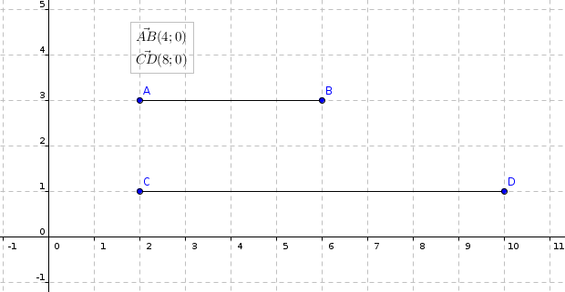
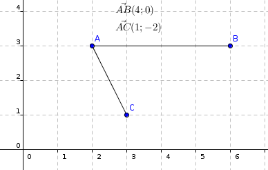
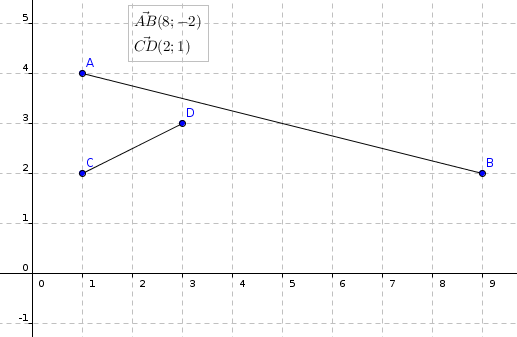
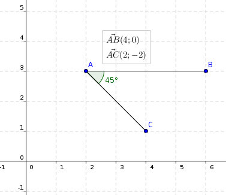

# Les produits scalaires

Ne soyez pas effrayé en entandant ce terme, les *produits scalaire* sont en réalité très simple à comprendre et à utiliser.

Il vous faut avoir des connaissances de base dans les vecteurs avant d'apprendre les produits scalaires.

Si vous souhaitez visionner un excellent cours très complet sur les vecteurs et les produits scalaires, je vous recommande l'intégralité de cette [vidéo YouTube](https://www.youtube.com/watch?v=gn_8Jt_t_BA).

## Qu'est-ce qu'un produit scalaire ?

Un **produit scalaire** n'est rien d'autre que le produit de deux vecteurs. Ce produit nous donnera toujours un nombre. Un produit scalaire s'écrit sous cette forme :
$$\vec{u} \cdot \vec{v}$$
Nous n'utilisons pas le signe $$\times$$ (multiplier) mais bien le $$\cdot$$ qui indique un produit scalaire. Ainsi, l'équation précédente se lit "*u scalaire v*".

## Comment calculer un produit scalaire ?

### Avec des vecteurs colinéaires

#### La théorie

C'est le cas le plus simple. Supposons que nous avons une force $$\vec{F}$$ et un vecteur $$\vec{AB}$$ colinéaires et de même sens. Ils sont donc parallèles et peuvent être superposés. Supposons également que nous connaissons ou que nous pouvons déduire la norme de ces vecteurs. Le produits scalaire de ces deux vecteurs sera donc :

$$\vec{F} \cdot \vec{AB} = ||\vec{F}|| \times ||\vec{AB}||$$

*Rappel* : La norme d'un vecteur $$\vec{u}$$ s'écrit $$||\vec{u}||$$. La norme est la "*longueur*" d'un vecteur. Sur un repère orthonormée, celle-ci peut se lire graphiquement sinon vous pouvez la calculer avec $$\sqrt{x^2 + y^2}$$.

**Attention**, si les deux vecteurs sont de sens opposés, l'équation change un peu.

$$\vec{F} \cdot \vec{AB} = -||\vec{F}|| \times ||\vec{AB}||$$

En effet, s'ils sont de sens opposés, un vecteur effectuent une force dans le sens opposé à l'autre vecteur, ainsi la force est négative. Il faut donc multiplier les deux normes par une force positive et une force négative.

#### Un cas pratique

Supposons le contexte suivant :

Nous avons donc deux vecteurs $$\vec{AB}$$ et $$\vec{CD}$$ respectivement de norme 4 et 8, ils ont la même direction et le même sens. Nous appliquerions alors la formule de la manière suivante :

$$\vec{AB} \cdot \vec{CD} = ||\vec{AB}|| \times ||\vec{CD}|| = 4 \times 8 = 32$$ 

Ainsi le produit scalaire de $$\vec{AB}$$ et $$\vec{CD}$$ vaut $$32$$.

### Avec des vecteurs non colinéaires, par projection

#### La théorie et la pratique

Parceque donner une théorie à ceci est compliqué, voyons la pratique directement. C'est exactement la même chose que avec des vecteurs colinéaires (voir juste au dessus) sauf que nous devons faire une **projection** avant. Voyez l'image suivante :

### Dans un repère orthonormal ($$O, \vec{i}, \vec{j}$$)

#### La théorie

Si vous êtes dans un repère orthonormal ($$O, \vec{i}, \vec{j}$$) et que vous avez deux vecteurs $$\vec{u}(x;y)$$ et $$\vec{v}(x';y')$$ et que vous connaissez leurs coordonnées, voici une équation permettant de calculer leur produit scalaire :

$$\vec{u} \cdot \vec{v} = xx' + yy'$$

#### Un cas pratique

Supposons qu'il vous est donné les deux vecteurs suivants : $$\vec{AB}(8;-2)$$ et $$\vec{CD}(2;1)$$. Alors leur produit scalaire sera :

$$\vec{AB} \cdot \vec{CD} = (8 \times 2) + ((-2) \times 1) = 16 - 2 = 14$$

### Si vous connaissez l'angle entre les deux vecteurs

#### La théorie

Si vous connaissez l'angle entre les deux vecteurs, alors l'équation suivante est possible :

$$\vec{u} \cdot \vec{v} = ||\vec{u}|| \times ||\vec{v}|| \times cos(\vec{u}, \vec{v})$$

#### Un cas pratique

Par exemple nous avons le vecteur $$\vec{AB}$$ de norme $$4$$ et le vecteur $$\vec{AC}$$ de norme $$2\sqrt{2}$$. Et l'angle entre ces deux vecteurs est de $$45°$$ (en degrès). **N'oubliez pas de programmez votre calculatrice en degrès.** Alors l'équation exacte sera :

$$\vec{AB} \cdot \vec{AC} = ||\vec{AB}|| \times ||\vec{AC}|| \times cos(\vec{AB}, \vec{AC}) = 4 \times 2\sqrt{2} \times cos(45) = 8$$